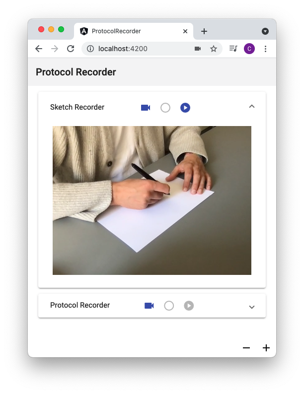
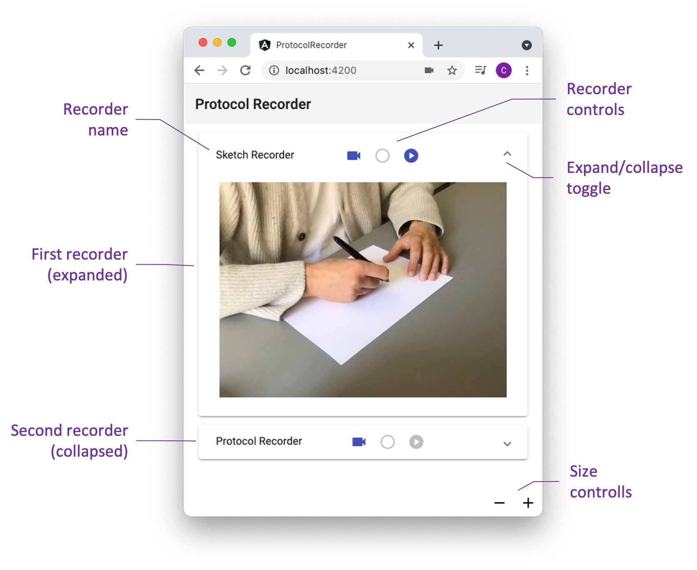
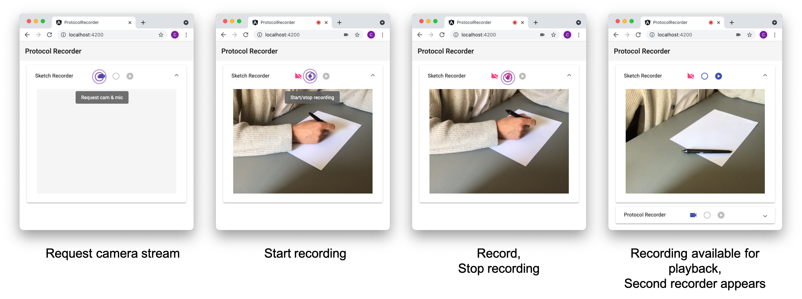
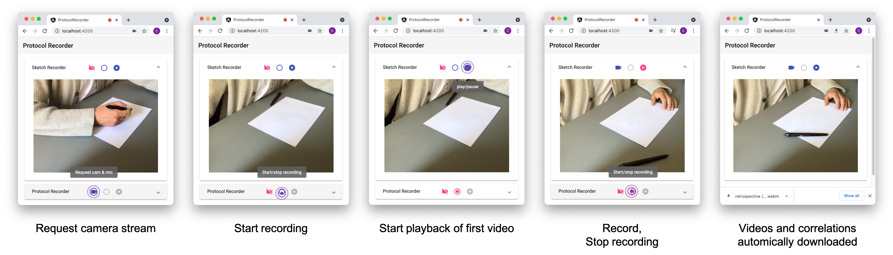

# Protocol Recorder

Tool to record retrospective protocol studies with nothing but your webcam and web browser.



This documentation contains following information:
- [Purpose and Features](#purpose-and-features): What is this good for and how can it help?
- [Interface](#interface): A description of the main components of the graphical user interface
- [Usage](#usage): How is the tool used?
- [Install, build, run](#install-build-run): How do I get the tool running on my machine?

## Purpose and Features

The tool is intended for recording retrospective protocol studies. In a retrospective protocol study, participants are given a task. They are filmed while solving the task. They then watch the recording and verbally reflect on what was going on in their minds during the solution process. The tool can be used to:

- Record the solution process 
- Playback the recording
- Record the retrospective reflection
- Record correltation between playback timings of the to video recordings

The last point is for synchronous playback of the recordings during the later analysis. Causes for changes in the correlation can be: pausing and resuming the playback of the first video during the restrospective.

## Interface

The following figure shows the main components of the graphical user interface of the recording tool.



- **Recorder name** displays the name of the recorder
- **First recorder** to record the task solution process
- **Recorder controls** can be used to:
  - Request the camera stream
  - Start/stop the recording
  - Playback (play/pause) the recording
- **Expand/collapse toggle** can be used to show or hide the video player
- **Video player** displays camera video stream or video recording
- **Second video player** to record the retrospective reflection
- **Size controls** to control the size of the video player

## Usage

### 1. Create recording of the task solution process



### 2. Create recording of the retrospective reflection



## Install, build, run

**Prerequesits**:
- [Node.js](https://nodejs.org/en/): you have a current version of Node.js including the package manager NPM and the package runner NPX installed on your system.
- [Git Client](https://git-scm.com/downloads): you have a Git client installed on your system, with which you can access the repository
- Access Rights: you have the necessary access rights to the Git project, ideally via [SSH](https://docs.gitlab.com/ee/ssh/)

**Installation**:

You only have to carry out the installation process once

1. Open a terminal window
2. Change to the directory in which you want to install the app
```bash
cd <path/to/install/dir>
```

3. Clone this repository
```bash
git clone <repository-url>
```

4. Change to the project directory
```bash
cd sketch-protocol-analyser
```

5. Install project dependencies
```bash
npm install
```

**Build and Run**:

6. Build app
```bash
npx ng serve
```

This will build the app and launch the dev server. Navigate to `http://localhost:4200/`. The app will automatically reload if you change any of the source files.

